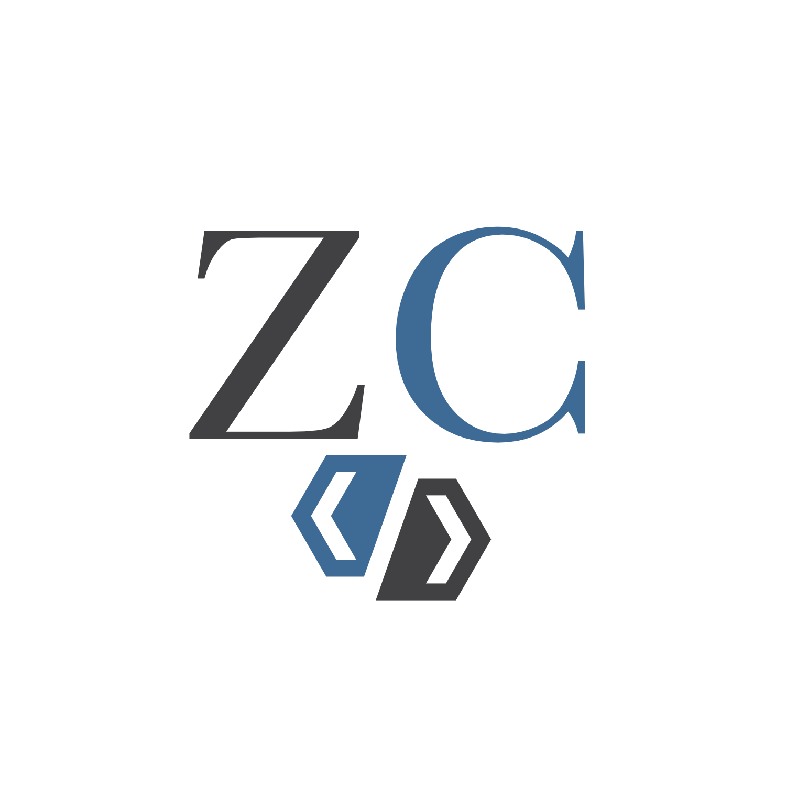

  
   

  <h3><b>To-do List</b></h3>

<!-- TABLE OF CONTENTS -->

# 📗 Table of Contents

- [📖 About the Project](#about-project)
  - [🛠 Built With](#built-with)
    - [Tech Stack](#tech-stack)
    - [Key Features](#key-features)
  - [🚀 Live Demo](#live-demo)
- [💻 Getting Started](#getting-started)
  - [Setup](#setup)
  - [Prerequisites](#prerequisites)
  - [Install](#install)
  - [Usage](#usage)
  - [Run tests](#run-tests)
  - [Deployment](#triangular_flag_on_post-deployment)
- [👥 Authors](#authors)
- [🔭 Future Features](#future-features)
- [🤝 Contributing](#contributing)
- [⭐️ Show your support](#support)
- [🙏 Acknowledgements](#acknowledgements)
- [📝 License](#license)

<!-- PROJECT DESCRIPTION -->

# 📖 To-do List 

To-do list is a tool that helps to organize your day. It simply lists the things that you need to do and allows you to mark them as complete, built using ES6 and Webpack!

## 🛠 Built With 

### Tech Stack 

- HTML
- CSS
- JavaScript
- Webpack

<!-- Features -->

### Key Features 

- **Mobile Responsive**
- **Modern Design**

(<a href="#readme-top">back to top</a>)

<!-- LIVE DEMO -->

## 🚀 Live Demo Coming Soon

- [Live Demo Link Coming Soon](#)

(<a href="#readme-top">back to top</a>)

<!-- GETTING STARTED -->

## 💻 Getting Started 

Clone the project and run the command `npm run start`, in case you get any error, try `HOST=0.0.0.0 npm run start`
### Prerequisites

need to have Node.js installed 

(<a href="#readme-top">back to top</a>)

<!-- AUTHORS -->

## 👥 Authors 

👤 **Cristian "ZamCham"**

- GitHub: [@zam-cham](https://github.com/zam-cham)
- Twitter: [@zamchamgames](https://twitter.com/zamchamgames)
- LinkedIn: [LinkedIn](https://linkedin.com/in/cristian-zamcham)

(<a href="#readme-top">back to top</a>)

<!-- FUTURE FEATURES -->

## 🔭 Future Features 

- [ ] **More Animations**
- [ ] **Sign Up Form**
- [ ] **Automatic Popups**

(<a href="#readme-top">back to top</a>)

<!-- CONTRIBUTING -->

## 🤝 Contributing 

Contributions, issues, and feature requests are welcome!

Feel free to check the [issues page](../../issues/).

(<a href="#readme-top">back to top</a>)

<!-- SUPPORT -->

## ⭐️ Show your support 

If you like this project, let me know on any of my social media account ;)

(<a href="#readme-top">back to top</a>)

<!-- ACKNOWLEDGEMENTS -->

## 🙏 Acknowledgments 

I would like to thank the Microverse team

(<a href="#readme-top">back to top</a>)

<!-- LICENSE -->

## 📝 License 

This project is [MIT](./LICENSE.txt) licensed.

(<a href="#readme-top">back to top</a>)

